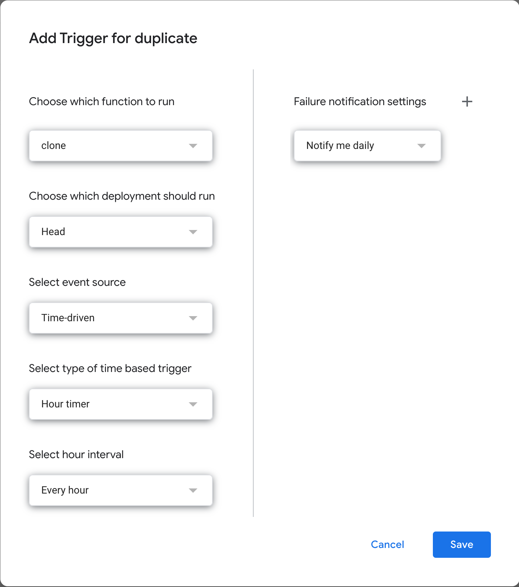

# Google Drive Cloner
Google drive does not provide a feature to clone a drive. This code will do that.

# How To Run

1. You need to prepare an empty google drive (i.e., `dstFolder`) where all files and directories in the original google drive (i.e., `srcFolder`) will be located.
1. Find the drive ID from the URL when you at the root folder. It looks like `0AN4hdaslv30wUk9XXX`.
   - If URL is like this `https://drive.google.com/drive/folders/0AN4hdaslv30wUk9XXX`, you can take at the last part of the URL. Say `0AN4hdaslv30wUk9XXX`.
1. Create Google Apps Script where you have access permission to `srcFolder`.
1. Since the execution time is limited to 30 min., you need to setup trigger like this:

# Warning
- During the execution, the script creates the file named `clone_done_identifer.txt` to every directory the cloning has been completed. So, if you want to clone all files and directories again, you need to remove the file. To do that, you can execute `RemoveDoneIdentifier`. Since this can also take large amount of time, you may need to setup the trigger as shown below in the previous image. Just change the field `Choose which function to run` from `duplicate` to `RemoveDoneIdentifier`.
